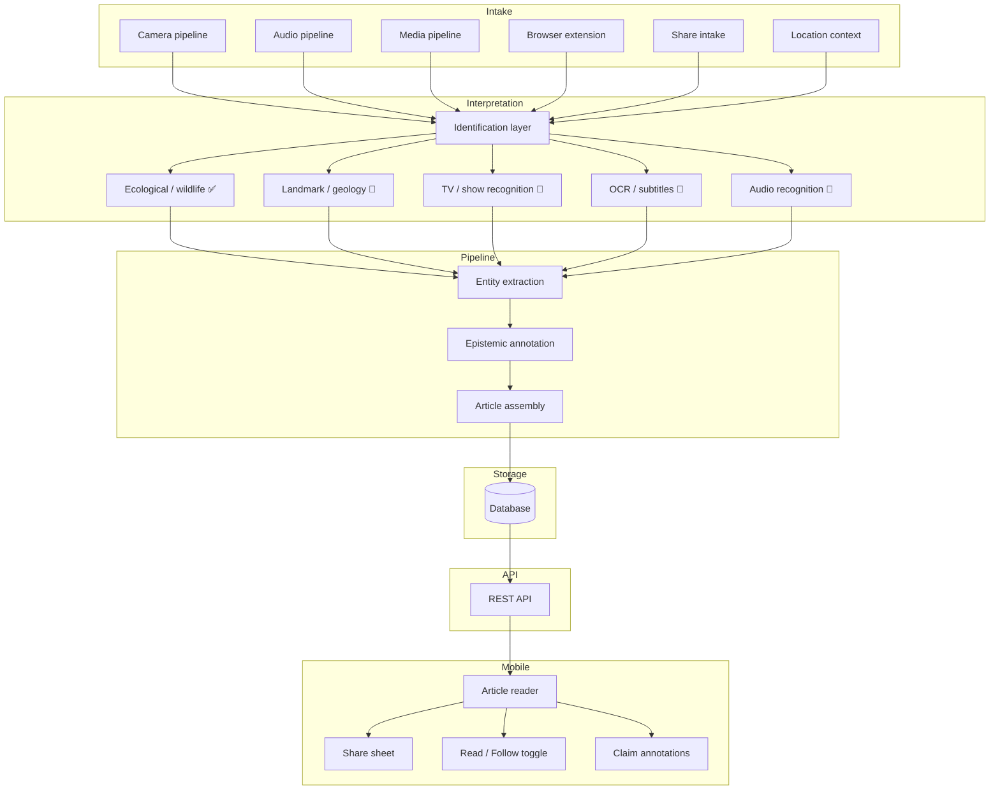

# System Architecture Specification v1

> **Authoritative reference.** Before recommending or implementing any changes, read this document and treat it as the source of truth for the Rabbit Hole platform. Do not modify this file unless explicitly instructed.

---

## Overview

Rabbit Hole is a knowledge-reader platform that lets users read articles, track claims with structured epistemic confidence levels, and share insights. The platform ingests content from multiple intake surfaces (camera, audio, browser extension, direct share), runs it through an interpretation pipeline, and presents structured, annotated articles to the user.

---

## System Status Key

| Symbol | Meaning |
|--------|---------|
| ✅ Implemented | Working code exists |
| 🟡 Fixture-backed | Implemented against static/mock data; real data source not yet connected |
| 🔲 Stubbed | Interface and contract defined; logic not yet implemented |

---

## Core Entity Relationships

```
Organization
  └─► Source          (a publication, channel, or account belonging to an org)
        └─► Article   (a piece of content from a source)
              └─► Claim  (an atomic statement within an article)
                    └─► EpistemicAnnotation  (confidence + support type on every claim)
```

### Entity Descriptions

| Entity | Description |
|--------|-------------|
| `Organization` | A publisher, broadcaster, or content owner (e.g. Reuters, BBC). |
| `Source` | A specific publication, channel, or account within an organization. |
| `Article` | A single piece of content surfaced to the user. Flows through the assembly pipeline. |
| `Claim` | An atomic, verifiable statement extracted from an article. |
| `EpistemicAnnotation` | The `confidence` + `support` label pair attached to every claim. |

TypeScript contracts live in `packages/contracts/src/`.

---

## Article Assembly Pipeline

Every article flows through these five stages in order. The `ExperienceStep` enum in the contracts package mirrors this pipeline.

```
identification → summary → content → evidence → questions
```

| Stage | Description | Status |
|-------|-------------|--------|
| `identification` | Source metadata, title, author, date, organization | ✅ Implemented |
| `summary` | Short human-readable synopsis | ✅ Implemented |
| `content` | Full article body with structured sections | ✅ Implemented |
| `evidence` | Citations, references, and provenance trace | ✅ Implemented |
| `questions` | Follow-up questions generated from the article | ✅ Implemented |

---

## Intake Surfaces

These are the entry points through which content enters the platform before it reaches the interpretation pipeline.

| Surface | Description | Status |
|---------|-------------|--------|
| Camera pipeline | Captures images or video frames from the device camera for visual analysis | ✅ Implemented |
| Audio pipeline | Captures microphone input for spoken-word or ambient audio recognition | 🔲 Stubbed |
| Media pipeline | Handles video files and streams for frame extraction and analysis | ✅ Implemented |
| Browser extension | Intercepts web pages and forwards article content to the API | 🟡 Fixture-backed |
| Share intake | Accepts content shared to the app via the OS share sheet | ✅ Implemented |
| Location context | Enriches intake events with device GPS/location data | ✅ Implemented |

---

## Interpretation Pipeline

The interpretation pipeline processes raw intake data and produces structured article entities.

```
raw intake
  └─► identification layer
        ├─► ecological / plant / wildlife identification  ✅ Implemented
        ├─► landmark / geology identification             🔲 Stubbed
        ├─► TV / show recognition                        🔲 Stubbed
        ├─► live subtitle / text extraction (OCR)        🔲 Stubbed
        └─► audio recognition                            🔲 Stubbed
  └─► entity extraction  (Article → Claim → Source → Organization)
  └─► epistemic annotation  (confidence + support on every claim)
  └─► article assembly  (identification → summary → content → evidence → questions)
```

> **Note:** Ecological / plant / wildlife identification groundwork is **already implemented** and must not be re-recommended or re-implemented.

---

## Supporting Systems

| System | Description | Status |
|--------|-------------|--------|
| Epistemic model | Confidence (`high`/`medium`/`low`) + support type (`direct`/`inference`/`interpretation`/`speculation`) labels on all claims | ✅ Implemented |
| Experience layer | `ArticleExperience` record tracking a user's progress through the assembly pipeline steps | ✅ Implemented |
| Verification system | Cross-references claims against known sources to flag contradictions | 🟡 Fixture-backed |
| Study system | Spaced-repetition and review tools built on article claims | 🔲 Stubbed |
| Market system | Surfaces trending or high-signal articles based on engagement patterns | 🔲 Stubbed |
| Organization intelligence | Aggregates source reliability and bias signals at the organization level | 🟡 Fixture-backed |

---

## UI Surfaces

New features must attach to an existing surface rather than introducing a new top-level screen unless strictly necessary.

| Surface | Description | Status |
|---------|-------------|--------|
| Article reader | Primary reading view; hosts the five-stage assembly pipeline | ✅ Implemented |
| Article toolbar | Row of actions at the top/bottom of the reader (share, follow, etc.) | ✅ Implemented |
| Share sheet | Native OS share surface pre-filled with title, summary, and URL | ✅ Implemented |
| Read / Follow toggle | Two-state control: marks article complete or subscribes to updates | ✅ Implemented |
| Claim annotation overlay | Inline badge showing `confidence` and `support` for each claim | ✅ Implemented |
| Identification result card | Card that surfaces the result of an identification pass (ecological, landmark, etc.) | 🟡 Fixture-backed |
| Organization profile | View of a publisher's reliability and bias summary | 🟡 Fixture-backed |

---

## Monorepo Layout

```
Rabbit_Hole/
├── apps/
│   ├── api/              # Backend REST API (Node.js)
│   └── mobile/           # Mobile reader (React Native / Expo)
├── packages/
│   └── contracts/        # Shared TypeScript types, interfaces, and schemas
│       └── src/
│           ├── epistemic.ts   — ClaimConfidence, ClaimSupport, EpistemicAnnotation
│           ├── experience.ts  — ArticleExperience, ExperienceStep
│           └── share.ts       — ArticleSharePayload
└── docs/
    ├── system-architecture-v1.md   ← this file
    ├── epistemic-model.md
    ├── experience-layer-v1.md
    └── share-surface-v1.md
```

---

## High-Level Component Diagram



---

## Dependency Order for New Features

When adding new capabilities, follow this dependency graph to avoid rework:

1. Intake surface must exist before an identification layer can consume it.
2. An identification layer must produce a structured entity before entity extraction can normalize it.
3. Entity extraction must run before epistemic annotation.
4. Epistemic annotation must complete before article assembly.
5. Article assembly must complete before a UI surface can display it.
6. New UI features must attach to an existing surface (see UI Surfaces table above).

---

## Related Documents

- [Epistemic Model](epistemic-model.md) — Full confidence and support specification
- [Experience Layer v1](experience-layer-v1.md) — ArticleExperience and ExperienceStep design
- [Share Surface v1](share-surface-v1.md) — Native share sheet implementation notes