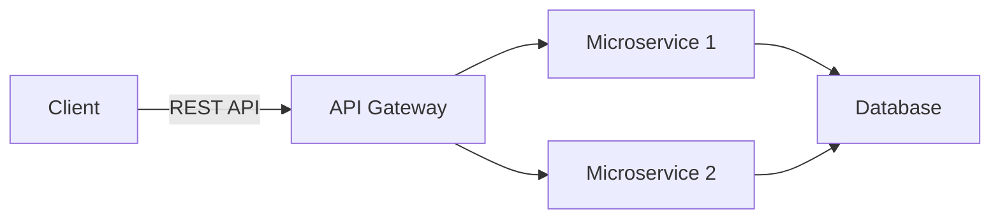

# System Architecture Specification v1

## Overview
This document outlines the canonical system architecture for the Rabbit Hole project.

## Components
- **Client**: The user interface for interacting with the system.
- **API Gateway**: Responsible for routing requests to appropriate services.
- **Microservices**: Individual services that handle specific business functions.
- **Database**: Storage of persistent data.

## Diagrams
### High-Level Architecture

## Conclusion
This architecture will support the scalability and maintainability required for the Rabbit Hole project.